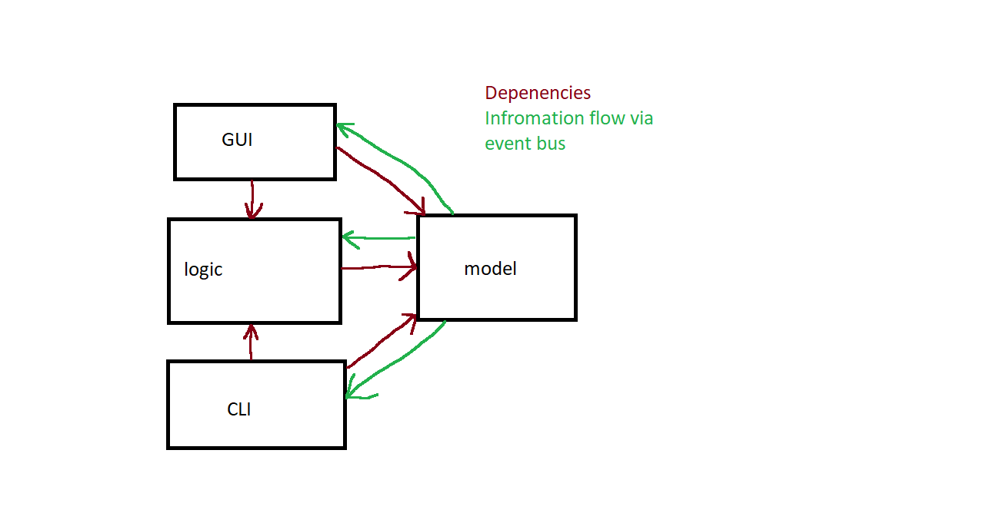

# Report for assignment 4

## Project

**Name:** JabRef

**URL:** https://github.com/JabRef/jabref

JabRef is a free open source reference management tool, specifically used for BibTeX and LaTeX format. It helps users collect, organize and search for bibliographic data.

### JabRef purpose (P+ criteria 1)

JabRef is designed to streamline the academic workflow by being a management tool for references. Some of the core features of JabRef are: 

- Automatic retrieval of bibliographic data from online sources such as arXiv or CrossRef. Automatic retrieval can be done by using unique identifiers like DOIs or ISBNs.
- Organize entries by using _collections_. Collections allow users to group entries based on for example keywords. This allows users to more easily find what they are looking for.
- **Citing.** JabRef allows users to conveniently cite entries as they write. JabRef supports many common writing tools as LaTeX, Word, LibreOffice, and many more.

### High-Level Architecture of JabRef (P+ criteria 1)
- At the center of JabRef we have the `model` which contains the most important stuff. It contains the main database and entries.
- Then we have the `logic` package which is responsible for manipulating the `model`.
- Interfaces. There is both and GUI and CLI. The GUI is the main way to use JabRef and is built using JavaFX. The Interfaces can use the `Locig` package to modify the `model`.
- Since a lot of other packages need to update when something occurs in the `model`, we need a way to update other parts of the system. JabRef uses a layered architecture which means that `model` should not depend on any other packages. JabRef solves this issue by using an event bus: when the `model` changes, events are triggered which the other packages can see and respond to.

Below is a diagram showing the main architecture. Red arrows show which dependencies are allowed. Green arrows shows how information travels via the event bus.

## Onboarding experience

Did you choose a new project or continue on the previous one?
We chose a new project as we could not run the test cases properly in Assignment 3.

If you changed the project, how did your experience differ from before?
The onboarding was faster as there was better documentation for https://github.com/JabRef/jabref.

How was the onboarding experience?
The project could be built by cloning the repo and following the instructions in the main project's README.md. The required tools to build the project is JabRef, Java 25 or later, and gradle 9.1 or later. However, gradle was not necessary to install since you could build using ./gradlew test.

The build sometimes conclude with errors in the tests, and several tests are ignored or skipped. Otherwise, building the project with ./gradlew build -x test succeeds.

One of the test, KeyBindingViewModelTest.verifyStoreSettingsWritesChanges(), had AssertionFailedError when project was run. But it has no relationship with BookCoverFetcher or PreviewViewer.

## Effort spent and contributions

### Melker Trané

Following is a list of how Melker spent his time:

1. plenary discussions/meetings (2 hours)

    Other tasks were sometimes done at the same time

2. discussions within parts of the group (1 hour)

3. reading documentation (2 hour)

4. configuration and setup (2 hours);

    The only tool that I did not already have was IntelliJ IDEA. Setting up IntelliJ took around 1.5 hours. The remaining 0.5 hours was spent on other stullf, like creating a fork and setting up github.

5. analyzing code/output (6 hours);

6. writing documentation (2 hours);

7. writing code (6 hours);

8. running code (2 hours)?
    
    This includes time running tests, and running the GUI with our code to see if it works.

During this assignment, Melker made the following contributions:
1. Made the GUI to initiate a download when an entry is opened, and refresh the GUI if successful.
2. Created the logic for creating and updating .not-available files
3. Wrote a few tests
4. Reviewed around 50% of other team members PRs
### Clarabelle
Following is a list of how Clarabelle spent his time:

1. plenary discussions/meetings (2 hours);

2. discussions within parts of the group (2 hours);

3. reading documentation (2 hours);

4. configuration and setup (4 hours);
I had to download jabref, IntelliJ IDEA. My laptop took a while to download the apps as it crashed multiple times.

5. analyzing code/output (3 hours);
The initial tests cases ran for 30 minutes each time.

6. writing documentation (4 hours)

7. writing code (0 hours);

8. running code (3 hours)?

During this assignment, Clarabelle made the following contributions:
1. Wrote the onboarding document
2. Checked how many initial tests failures

### Edwin Nordås Jogensjö

Time spent by Edwin:

1. plenary discussions/meetings: 2 hours

2. discussions within parts of the group: -

3. reading documentation: 4 hours

4. configuration and setup: 2-3 hours

    I had many problems with getting the language server and LSP to work with this project. Also, some gui tests didn't work on my PC because of screen sharing problems.

5. analyzing code/output: 5 hours

6. writing documentation: 1 hour

7. writing code: 4 hours

8. running code: 2 hours

Statement of contribution (Edwin):
1. Identified tests that were missing and implemented some of them.
2. Changed/refactored relevant files that made the code possible to test and mock.
3. Cleared up the usage of `destination.get()` according to suggestions from a contributor.

### Vidar Nykvist

Time spent by Vidar:

1. plenary discussions/meetings: 2 hours

2. discussions within parts of the group: 1

3. reading documentation: 2 hours

4. configuration and setup: 8 hours
I had extremely many dependency errors when trying to get this to work on NixOS, I also had problem with that executing some of the tests required Java Amazon Corretto25 which was only available in the unstable branch, however when I looked at the jabref flake in nix-packages they remove this requirement which I eventually also did. I eventually solved this entire problem by creating a nix-shell and iteratively adding each missing dependency. I also had problems with getting the LSP working for this project which I decided to skip after a while. I also spent some time attempting to compile and run tests on the KTH:s SSH server but quickly gave up since it does not have a access to a gui.

5. analyzing code/output: 3 hours

6. writing documentation: 5 hour

7. writing code: 3 hours

8. running code: 2 hours

Statement of contribution (Vidar):
1. Implemented logic for checking if 24 hours had passed (after .not-available functionality was in place)
2. Created UML Class diagram and description.
3. Created flowcharts and description of architecture of our implementation. 

For each team member, how much time was spent in

1. plenary discussions/meetings;

2. discussions within parts of the group;

3. reading documentation;

4. configuration and setup;

5. analyzing code/output;

6. writing documentation;

7. writing code;

8. running code?

For setting up tools and libraries (step 4), enumerate all dependencies
you took care of and where you spent your time, if that time exceeds
30 minutes.

## Overview of issue(s) and work done.

Title:

URL:

Summary in one or two sentences

Scope (functionality and code affected).

## Requirements

| ID   | Title                    | Description                                                                                                                                                      |
| ---- | ------------------------ | ---------------------------------------------------------------------------------------------------------------------------------------------------------------- |
| RE01 | Automatic retrieval      | When a book is opened and no local image file exists for that book, the system should trigger an online search and download of the cover.                        |
| RE02 | Availability flagging    | If a book cover is not available for download, the system should create a file with the ISBN of the book and extension .not-available to document unavailabilty. |
| RE03 | 24-hour check constraint | If a previous attempt of downloading a cover has failed, the system should not try another attempt for the same book within 24-hour time window.                 |
| RE04 | Background processing    | The downloading process should be a background activity, and should not interfere with or delay user interface when a book is opened.                            |

## Existing tests analysis

There doesn't seem to be any tests related to the issue. The file `jabgui/src/main/java/org/jabref/gui/importer/BookCoverFetcher.java`, which is used to fetch book covers, is not covered at all by any tests.

We therefore created some tests that should fail before implementing functionality for the requirements. The tests are written in the file `BookCoverFetcherTest.java` on the main branch, available through this link:

https://github.com/DD2480-Group-14/Assignment4-jabref/blob/main/jabgui/src/test/java/org/jabref/gui/importer/BookCoverFetcherTest.java. 

Below shows what tests are related to which requirement:

### RE02 - Availability flagging
    - `createNotAvailableFileAfterFailedDownload` - tests that a ".not-available" file is created after a failed download.
    - `getNoCoverWhenNotAvailableFileIsPresent` - checks that we don't get any cover if the ".not-available" file is present.
    - `notAvailableFileIsDeletedAfterSuccessfulDownload` - checks that the ".not-available" file is deleted when the cover is successfully downloaded.

### RE03 - 24-hour check constraint
    - `checkBookCoverFetchCooldown` - Checks that the system does not try to download a book cover again when it just tried and failed.
    - `modificationTimeChangesWhenMoreThan24Hours` - Asserts that the modification time is updated when a download is attempted after more than 24 hours since last time.
    - `modificationTimeDoesNotChangeWhenLessThan24Hours` - Asserts that the modification time is not updated when the system tried to download less than 24 hours ago.

### RE01 and RE04:

    - We don't have any unit tests for these requirements as they depend on the GUI. However, we have tested them manually by building and using JabRef locally. 

## Code changes

### Patch

Link to main PR to JabRef: https://github.com/JabRef/jabref/pull/15250

## Test results
### Before implementation
#### Test report
The initial test execution for the jabgui module was performed using 
`./gradlew :jabgui:test: --info`.

Out of 770 executed tests, 5 tests failed, and 9 tests were skipped.

Identified Failures:
- `KeyBindingsTabModelTest.randomNewKeyKeyBindingInRepository()`
- `PushToTeXworksTest.pushEntries()`
- `GlobalSearchBarTest.recordingSearchQueriesOnFocusLostOnly(FxRobot)`
- `GlobalSearchBarTest.emptyQueryIsNotRecorded(FxRobot)`
- `ThemeManagerTest.liveReloadCssDataUrl()`

The failing tests seem to be unrelated to the book cover download functionality. They are therefore not expected to interfere with the implementation of the new cover retrieval feature.

Full test log is included [here](https://github.com/DD2480-Group-14/Assignment4-jabref/tree/report/DD2480/reports/test-before/test-log.txt).

#### Coverage report
Even though the test execution was limited to the `jabgui` module, the coverage report includes metrics for the entire project.

| Metric | Coverage % | Raw numbers   |
| ------ | ---------- | ------------- |
| Class  | 25,9%      | (609/2350)    |
| Method | 15,7%      | (2675/17000)  |
| Branch | 9,8%       | (3783/38451)  |
| Line   | 14,1%      | (10997/77950) |

Full coverage report in HTML is included [here](https://github.com/DD2480-Group-14/Assignment4-jabref/tree/report/DD2480/coverage-before/index.html).

### After implementation
#### Test report
#### Coverage report

## UML class diagram and its description

The diagram shows 8 classes that are involved in the resolved issue. `PreviewViewer` initiates the download process depending on the `GuiPreferences` -> `PreviewPreferences`. If it should attempt download then it uses the `BookCoverFetcher` to do so and starts this as a `BackgroundTask`, as specified in the requirements. `BookCoverFetcher` is where the majority of our changes are located. The (already existing) download logic extracts the `ISBN` from `BibEntry` to identifiy the book and download the cover. Our implementation creates a `CustomExternalFileType` `".not-available"` for missing book covers, we then check the "last modified" timestamp of that file, if it was more than 24 hours, we can attempt to download again.

### Key changes/classes affected

Optional (point 1): Architectural overview.

Optional (point 2): relation to design pattern(s).

## Overall experience

What are your main take-aways from this project? What did you learn?

Optional (point 6): How would you put your work in context with best software engineering practice?

Optional (point 7): Is there something special you want to mention here?

### Progress of the Team

We would argue that we are now in the `performing` stage where we work effectively and efficiently, if we had more time we could probably become even more efficient. We can also see that with this assignment we are moving into the `adjourned` stage since this our final assignment.

### Way of Working
The following checklists are provided to help assess the current status of our team. 

**Principles Established**

- [x] Principles and constraints are committed to by the team.
- [x] Principles and constraints are agreed to by the stakeholders.
- [x] The tool needs of the work and its stakeholders are agreed. 
- [x] A recommendation for the approach to be taken is available. 
- [x] The context within which the team will operate is understood. 
- [x] The constraints that apply to the selection, acquisition, and use of practices and tools are known.

**Foundation Established**
- [x] The key practices and tools that form the foundation of the way-of-working are
  selected. 
- [x] Enough practices for work to start are agreed to by the team. 
- [x] All non-negotiable practices and tools have been identified. 
- [x] The gaps that exist between the practices and tools that are needed and the practices and tools that are available have been analyzed and understood. 
- [x] The capability gaps that exist between what is needed to execute the desired way of working and the capability levels of the team have been analyzed and understood. 
- [x] The selected practices and tools have been integrated to form a usable way-of-working.

**In Use**
- [x] The practices and tools are being used to do real work. 
- [x] The use of the practices and tools selected are regularly inspected.
- [x] The practices and tools are being adapted to the team’s context.
- [x] The use of the practices and tools is supported by the team. 
- [x] Procedures are in place to handle feedback on the team’s way of working. 
- [x] The practices and tools support team communication and collaboration.

**In Place**
- [x] The practices and tools are being used by the whole team to perform their work. 
- [x] All team members have access to the practices and tools required to do their work. 
- [x] The whole team is involved in the inspection and adaptation of the way-of-working.

**Working Well**
- [x] Team members are making progress as planned by using and adapting the way-of-working to suit their current context. 
- [ ] The team naturally applies the practices without thinking about them.
- [ ] The tools naturally support the way that the team works.
- [x] The team continually tunes their use of the practices and tools.

**Retired**
- [x] The team's way of working is no longer being used.
- [ ] Lessons learned are shared for future use.

We assess our team to be in the `In Place` state. The selected practices and tools were being actively used by the whole team, supporting the collaboration, quality and efficiency of our work. We've gotten a deeper understanding of each other's communication styles and work preferences throughout the assignments, which has continuously strengthened our teamwork.

We don't claim to have reached the `Working Well` state since our workflow was consciously adapted to the specific requirements of each assignment. One example is that quite some time was spent on reading the documentation and setting up the JabRef architecture. We also had to adapt to the workflow of the JabRef contribution community which resulted in the tools and practices never becoming "invisible".

One could argue that we almost reached the `Retired` state as well since this is our final assignment and our way of working will no longer be in use. However, to achieve this state documentation of lessons learned compiled from all assignments should be established.

